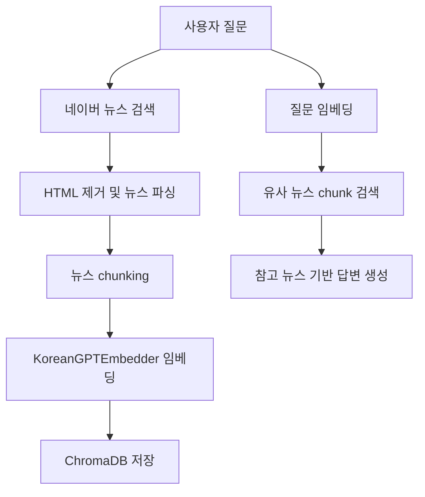

# Korean Chatbot RAG

한국어 챗봇 모델을 직접 학습하고, 네이버 뉴스 검색 기반 RAG 흐름까지 연결하는 프로젝트입니다.  
기본 모델은 Decoder-only Transformer 구조의 `KoreanGPT`이며, SentencePiece 토크나이저를 사용합니다.

## 프로젝트 목표

1. 한국어 텍스트로 SentencePiece 토크나이저를 학습합니다.
2. GPT 모델을 다음 토큰 예측 방식으로 사전학습합니다.
3. `질문 -> 답변` 형식의 QA 데이터로 파인튜닝합니다.
4. 네이버 뉴스 검색 API로 사용자 질문 관련 뉴스를 가져옵니다.
5. 뉴스 HTML 태그를 제거하고 chunking 합니다.
6. 직접 학습한 `KoreanGPTEmbedder`로 뉴스 chunk를 임베딩합니다.
7. ChromaDB에 질문과 뉴스 chunk를 저장합니다.
8. 검색된 참고 뉴스를 기반으로 답변을 생성합니다.

## 실행 위치

Mac 기준 프로젝트 루트:

`main.py`를 직접 실행하면 상대 import 때문에 오류가 날 수 있습니다.

```bash
# 권장
python -m korean_chatbot_RAG.src.model.main train_qa
```


## 주요 구조

```text
korean_stock_chatbot/
└── src/
    └──  app/
        └──  app.py

    └── model/
        └── checkpoints/
            ├── KoreanGPT.pt
            └── KoreanGPT_qa.pt

        └── data/
            └── processed/

            └── raw_hf/
                └── news/

                └── nlpbada/
                    
                └── smalltalk/

                    
        └── embed/
            └── embedder.py          # KoreanGPT 기반 임베딩 생성
       
        └── rag/
            ├── baseline.py
            └── evaluate_rag.py
        
        └── scripts/
            ├── prepare_pretrain.py  
            └── prepare_finetune.py  # QA 파인튜닝 CSV 생성
        
        └── store/
            └── vector_store.py      # 뉴스 파싱, chunking, ChromaDB 저장/검색
            
        └── train/
            ├── model.py             # Decoder-only KoreanGPT 모델
            ├── tokenizer.py         # 학습/파인튜닝 데이터 로딩
            ├── sp_tokenizer.py      # SentencePiece 학습/로드/인코딩
            ├── train.py              # 실행 진입점
            └── train_utils.py       # batch 생성, 학습 루프, QA 파인튜닝 배처
            
        ├── chat.py              # 일반 대화, QA 대화, RAG 답변 생성
        └── search.py            # 네이버 뉴스 검색 API 호출
        
├── .gitignore
├── .python-version
├── main.py
├── pyproject.toml
├── README.md
├── requirements.txt
└── uv.lock
```

## 설치

가상환경 생성 후 의존성을 설치합니다.

```bash
python -m venv .venv
source .venv/bin/activate
pip install -r requirements.txt
```

주요 의존성:

```text
torch
sentencepiece
fastapi
uvicorn[standard]
Korpora
datasets
pandas
chromadb
python-dotenv
google-genai
```

## 환경변수

프로젝트 루트에 `.env`를 만들고 API 키를 설정합니다.

```env
NAVER_CLIENT_ID=네이버_클라이언트_ID
NAVER_CLIENT_SECRET=네이버_클라이언트_SECRET
GOOGLE_API_KEY=Gemini_API_KEY
```

역할:

| 환경변수 | 사용 위치 | 용도 |
|---|---|---|
| `NAVER_CLIENT_ID` | `search.py` | 네이버 뉴스 검색 API 인증 |
| `NAVER_CLIENT_SECRET` | `search.py` | 네이버 뉴스 검색 API 인증 |
| `GOOGLE_API_KEY` | `evaluate_rag.py` | Gemini 2.5 Flash retrieval 평가 |

## 데이터 준비

최종적으로 QA 파인튜닝 파일은 아래 위치에 있어야 합니다.

```text
data/processed/qa_train.csv
data/processed/qa_val.csv
```

정상이라면 최소한 아래 파일이 보여야 합니다.

```text
pretrain.txt
qa_train.csv
qa_val.csv
```

QA CSV 기본 형식:

```csv
question,answer
"질문 내용","답변 내용"
```

RAG instruction fine-tuning에 사용할 형식:

```csv
question,answer
"참고 뉴스:
제목: 삼성전자 반도체 실적 개선 기대
내용: 삼성전자의 반도체 업황 회복 기대감이 커지고 있다는 내용의 뉴스입니다.

질문: 삼성전자 주식 뉴스 알려줘","참고 뉴스에 따르면 삼성전자는 반도체 업황 회복 기대감과 관련해 주목받고 있습니다."
```

중요한 점은 `question` 컬럼 안에 이미 `참고 뉴스 + 질문`이 들어간다는 것입니다.

## 학습 흐름

### 1. Stage 1 사전학습

한국어 텍스트를 다음 토큰 예측 방식으로 학습합니다.

```bash
python -m korean_chatbot_RAG.src.model.main train
```

생성되는 체크포인트:

```text
korean_chatbot_RAG/src/model/checkpoints/KoreanGPT.pt
```

### 2. Stage 2 QA 파인튜닝

`qa_train.csv`, `qa_val.csv`를 이용해 질문-답변 형식으로 파인튜닝합니다.

```bash
python -m korean_chatbot_RAG.src.model.main train_qa
```

생성되는 체크포인트:

```text
korean_chatbot_RAG/src/model/checkpoints/KoreanGPT_qa.pt
```

## RAG 흐름


흐름:

1. 사용자 질문 입력
2. 질문으로 네이버 뉴스 검색
3. 검색 뉴스 chunk 저장
4. ChromaDB에서 유사 chunk 검색
5. 검색된 참고 뉴스를 prompt에 넣음
6. `KoreanGPT_qa.pt` 모델이 답변 생성


현재 문제점:
- 검색과 retrieval 자체는 동작합니다.
- 하지만 모델이 "참고 뉴스만 보고 답변하는 방식"을 충분히 학습하지 않았습니다.
- 따라서 뉴스 내용을 모델에 계속 넣어 학습시키는 것보다, 참고문서 기반 답변 형식을 fine-tuning 해야 합니다.

## Retrieval 평가

Gemini 2.5 Flash로 검색된 뉴스 chunk가 질문과 관련 있는지 평가합니다.

```bash
python -m korean_chatbot_RAG.src.model.evaluate_rag
```

평가 기준:

| 항목 | 의미 |
|---|---|
| `retrieval_relevance` | 검색 결과가 질문과 의미적으로 관련 있는지 |
| `keyword_match` | 질문의 핵심 키워드가 검색 결과에 반영되었는지 |
| `context_usefulness` | 해당 chunk만으로 답변을 만들 수 있는지 |
| `pass` | RAG 답변 생성에 사용할 만한 검색 결과인지 |
| `reason` | 평가 이유 |

Gemini 평가 결과는 답변 품질이 아니라 retrieval 품질을 보는 용도입니다.

## 실행 명령어 요약

```bash
# 프로젝트 루트 이동
cd /Users/djdj1473/PythonProject/KTB4-eric-AI/week6

# 의존성 설치
pip install -r requirements.txt

# Stage 1 사전학습
python -m korean_chatbot_RAG.src.model.main train

# Stage 2 QA/RAG instruction 파인튜닝
python -m korean_chatbot_RAG.src.model.main train_qa

# 네이버 뉴스 검색 후 ChromaDB 색인
python -m korean_chatbot_RAG.src.model.main index_news

# RAG 답변 생성
python -m korean_chatbot_RAG.src.model.main chat_rag

# Gemini 기반 retrieval 평가
python -m korean_chatbot_RAG.src.model.evaluate_rag
```

## 현재 상태 요약

완료된 것:

- 네이버 뉴스 검색 API 연결
- 사용자 질문 기반 뉴스 검색
- 뉴스 HTML 태그 제거 및 텍스트 파싱
- 뉴스 chunking
- `KoreanGPTEmbedder` 기반 embedding
- ChromaDB에 질문 ID, 뉴스 chunk 저장
- 유사 뉴스 chunk 검색
- Gemini 2.5 Flash 기반 retrieval 평가
- RAG 답변 생성 흐름 연결

