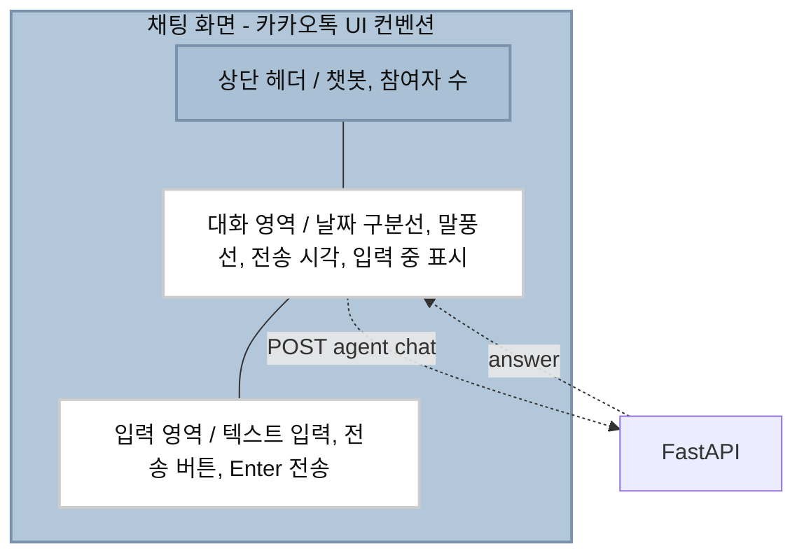
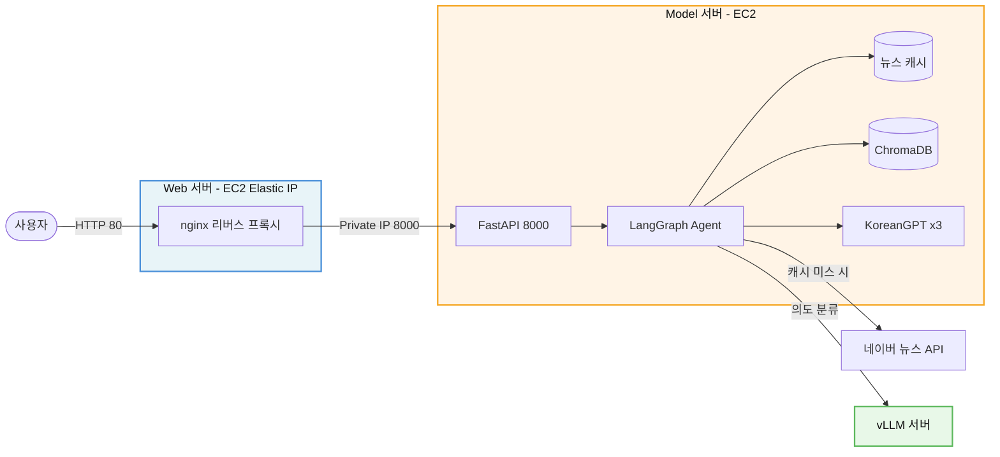
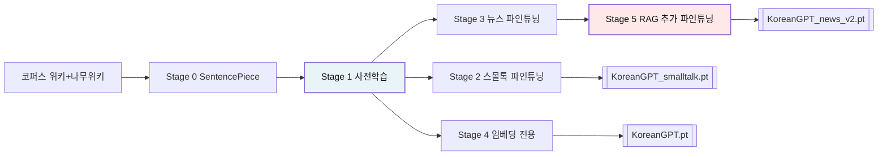
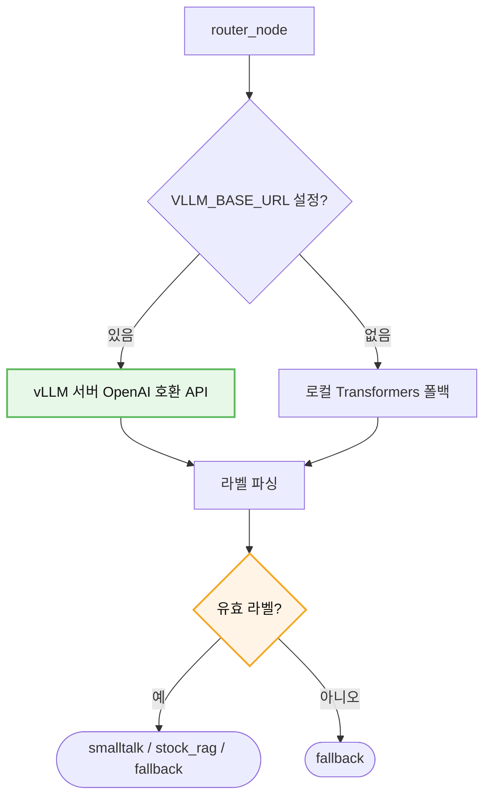
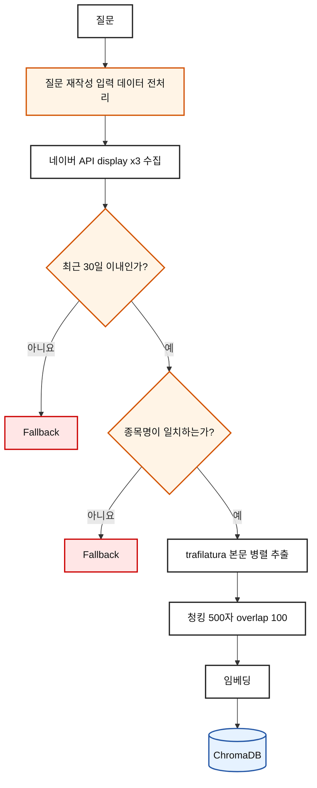
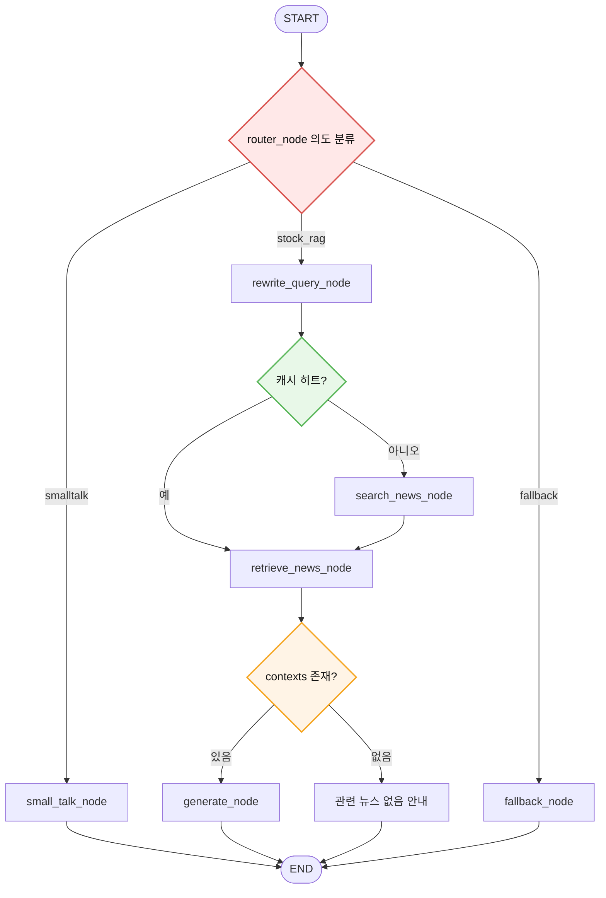
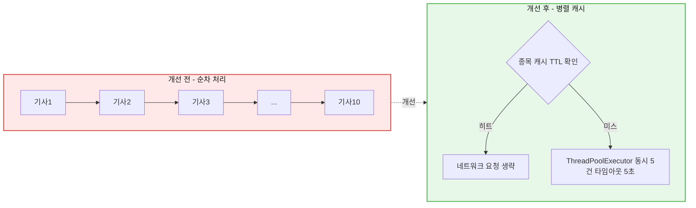
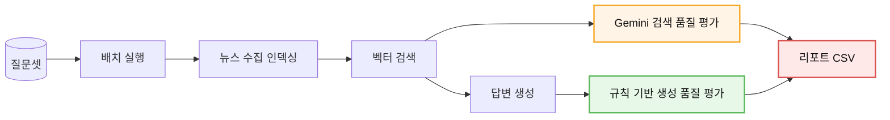
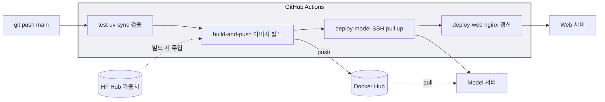
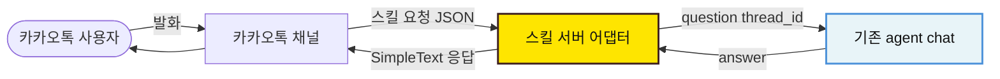

# 한국어 Mini-GPT 기반 주식 뉴스 챗봇

SentencePiece 토크나이저 → Decoder-only Transformer 사전학습 → 도메인 파인튜닝 → RAG → LangChain/LangGraph 파이프라인 → 자동 평가 → CI/CD 배포까지 전 과정을 직접 구현한 한국어 챗봇.
네이버 뉴스 API를 지식 소스로 사용해 **국내 상장 종목**에 대한 최신 뉴스 질문에 특화하여 답변한다.

**모델**: [Dongju-00/eric-chatagent](https://huggingface.co/Dongju-00/eric-chatagent)

<br>

## 특징

| 항목 | 내용 |
|---|---|
| 모델 | KoreanGPT (~42M, Decoder-only Transformer 자체 구현) — 스몰톡 / 뉴스 / 임베딩 3종 |
| 검색 | 네이버 뉴스 API + 자체 임베더 기반 ChromaDB 벡터 검색 + distance 임계값 필터 |
| 질문 재작성 | 상장사 별칭 사전 · 의도 추출 · 시간 표현 정규화로 검색어 자동 생성 |
| 파이프라인 | LCEL 체인 · LangGraph StateGraph (조건부 분기 3경로) |
| 자동 라우팅 | LLM이 질문 유형 분류(smalltalk / stock_rag / fallback) → 경로 자동 선택 |
| 자동 평가 | 생성 품질(반복률·근거성·형식)은 규칙 기반, 검색 품질은 LLM-as-judge로 이원화하여 정량 측정 |
| 비교 실험 | 자체 모델과 대형 모델(Gemini)의 생성 품질을 동일 컨텍스트로 정량 비교 |
| 성능 최적화 | 본문 추출 병렬화 · 종목별 뉴스 캐싱으로 응답 지연 개선 |
| UI | 카카오톡 스타일 채팅 인터페이스 (Vanilla JS) — 카카오톡 채널 이식을 염두에 둔 설계 |
| 서빙 | FastAPI + nginx 리버스 프록시, 웹/모델 서버 물리 분리 |
| 라우터 서빙 | vLLM 외부 서버 연동 (`VLLM_BASE_URL`), 미설정 시 로컬 모델 폴백 |
| 배포 | GitHub Actions 4-job 파이프라인 → Docker Hub → EC2 2대 자동 반영 |
| 모델 배포 | 가중치를 Git이 아닌 Hugging Face Hub에서 이미지 빌드 시 주입 |

<br>

## 화면 구성도



**카카오톡 UI를 따른 이유**: 국내 사용자에게 가장 익숙한 채팅 인터페이스이므로 별도 학습 없이 사용할 수 있고, 이후 카카오톡 채널 챗봇으로 이식할 때 사용자 경험의 단절이 없다. 말풍선 정렬, 시간 표기, Enter 전송 규칙 등 인터랙션 컨벤션을 미리 맞춰 두었다.

<br>

## 전체 구조도



서버를 나눈 이유는 OOM 장애 때문이다. 초기에는 단일 인스턴스에서 웹 서빙과 모델 추론을 함께 처리했는데, 모델이 메모리를 소진하면 웹 서버까지 동시에 죽어 서비스 전체가 중단됐다. 역할을 분리한 뒤로는 모델 서버에 장애가 발생해도 nginx가 살아 있어 사용자에게 상태를 안내할 수 있다.

<br>

## 학습 파이프라인



단계를 나눈 이유는 각 Stage가 서로 다른 능력을 순서대로 쌓기 위해서다. 처음부터 도메인 응답 포맷으로만 학습하면 언어 자체를 충분히 익히지 못한 채 형식만 흉내 내는 모델이 된다. 먼저 대규모 텍스트로 언어 패턴을 익힌 뒤, 그 위에 태스크를 순차적으로 올리는 전이학습 구조다.

| Stage | 역할 | 결과물 | 단계를 나눈 이유 |
|---|---|---|---|
| Stage 0 | SentencePiece 토크나이저 학습 | `sp_korean.model` | 한국어는 교착어라 공백 분리로는 어휘가 폭발한다. 서브워드 단위로 어휘를 압축해 소규모 모델에서도 표현력을 확보 |
| Stage 1 | 이어쓰기 사전학습 (위키 + 나무위키 430M 토큰) | `KoreanGPT.pt` | 베이스 언어 능력 확보. 다음 토큰 예측으로 어휘·문법·문맥을 먼저 학습. 초기 34M 토큰 / 23M 파라미터에서 확대 |
| Stage 2 | 스몰톡 파인튜닝 | `KoreanGPT_smalltalk.pt` | 단일 모델로 잡담과 뉴스 요약을 모두 처리하면 응답 성격이 섞인다. 도메인별 체크포인트를 분리해 각 경로에서 전용 모델을 로드 |
| Stage 3 | 뉴스 요약 파인튜닝 | `KoreanGPT_news.pt` | 참고 뉴스를 받아 요약하는 형식(`참고 뉴스: … 질문: … 답변: …`)을 학습 |
| Stage 4 | 임베딩 전용 사용 | `KoreanGPT.pt` | 외부 임베딩 모델 없이 RAG 전 과정을 자체 모델로 구성하는 것이 목표였다. Stage 1 체크포인트의 hidden state를 평균해 문서 벡터로 사용 |
| Stage 5 | RAG 추가 파인튜닝 | `KoreanGPT_news_v2.pt` | 학습 데이터 3,084건 중 28%를 "참고 뉴스에 해당 정보가 없습니다" 케이스로 구성해, 근거 없는 생성을 억제하는 방향으로 접근했다. 아래 비교 실험 결과 이 방향성 자체는 유효했음을 확인했고, 42M 규모라는 파라미터 한계가 최종 품질의 병목이라는 점도 함께 규명했다 |

**최적화**: PyTorch 내장 최적화 어텐션(causal mask 자동 처리) · 답변 토큰만 손실 계산(프롬프트 `-100` 마스킹) · 낮은 학습률(1e-5)로 기존 지식 보존 · 코사인 스케줄러 + 워밍업

<br>

## 모델 아키텍처

학습된 가중치(`.pt`)는 용량 문제로 저장소에 포함되지 않으며, Hugging Face Hub에서 주입된다.

### KoreanGPT — 생성 / 임베딩

GPT-2와 동일한 Decoder-only Transformer를 Multi-Head Attention부터 직접 구현.

| 하이퍼파라미터 | 값 |
|---|---|
| block_size | 384 |
| 파라미터 수 | ~42M |
| 학습 코퍼스 | 위키 + 나무위키 430M 토큰 |
| 토크나이저 | SentencePiece (자체 학습) |

| 파일 | 역할 |
|---|---|
| `KoreanGPT.pt` | Stage 1 — 문서·질문 임베딩 생성 (RAG 벡터 검색) |
| `KoreanGPT_smalltalk.pt` | Stage 2 — 일상 대화 응답 |
| `KoreanGPT_news_v2.pt` | Stage 5 — 검색된 뉴스 기반 답변 생성 |

### 생성 파라미터

소규모 모델은 반복 루프에 빠지기 쉬워 샘플링 제어가 필수였다.

| 파라미터 | 값 | 선택 이유 |
|---|---|---|
| `temperature` | 0.3 | 뉴스 요약은 사실 전달이 목적이므로 무작위성을 낮춤 |
| `top_k` | 10 | 확률이 낮은 토큰을 후보에서 배제 |
| `repetition_penalty` | 1.3 | 동일 구절 반복 억제 (부호에 따라 나눗셈/곱셈 분기 적용) |

### 라우터 모델 — 서빙 방식 선택

질문 분류에는 지시를 따르는 능력이 필요해 자체 모델(42M) 대신 Instruct 계열 공개 가중치를 사용한다. `VLLM_BASE_URL` 환경변수 유무로 서빙 방식이 자동 분기된다.



| 방식 | 백엔드 | 메모리 | 특징 |
|---|---|---|---|
| vLLM (권장) | vLLM OpenAI API | 외부 서버 | PagedAttention · continuous batching, 앱 프로세스와 메모리 격리 |
| 로컬 Transformers | Transformers CPU | 앱 프로세스 내 | 환경변수 미설정 시 폴백, 가용성 확보 |
| 외부 API | Google Gemini | 없음 | 초기 구현, 의존성 제거 대상 (graph.py에 주석 처리로 보존) |

**vLLM을 도입한 이유**: 라우터 모델을 앱 프로세스 안에 로드하면 KoreanGPT 3종 + ChromaDB와 메모리를 공유해 OOM 위험이 커진다. 외부 서버로 분리하면 메모리가 격리되어 라우터 장애가 앱 전체로 번지지 않고, PagedAttention · continuous batching으로 동시 요청 처리량도 개선된다. 서버가 응답하지 않으면 로컬 모델로 폴백해 가용성을 유지한다.

**파싱 방어**: 소규모 모델은 지시한 라벨 형식을 벗어나는 경우가 있어(`'주식'`, `'주식 inquiry'` 등), 영어 라벨·한국어 키워드를 모두 수용하고 매칭 실패 시 `fallback`으로 처리하도록 파서를 이중화했다.

<br>

## RAG 파이프라인

**지식 소스**: 네이버 뉴스 검색 API — 질문 시점에 실시간 수집 후 인덱싱 (사전 구축된 고정 지식 베이스가 아님)

주식 뉴스는 시의성이 생명이라 미리 인덱싱해 둔 문서로는 답할 수 없다. 그래서 질문마다 뉴스를 새로 수집하고, `question_id`로 격리해 해당 질문의 컨텍스트만 검색하도록 설계했다. 동시에 최근 질의한 종목은 Vector DB에서 즉시 재사용할 수 있어, 반복 질문에 대한 응답 경로를 단축했다.

### STEP 1 — 기본 검색과 입력 전처리

질문에서 불필요한 어미·노이즈·줄임말을 정리하는 전처리(질문 재작성)를 거쳐 네이버 API에 전달하고, 수집한 기사의 본문을 청킹해 인덱싱한다.

### STEP 2 — 본문 추출과 필터링



- `trafilatura` 본문 추출 — `description` 대신 원문 링크에서 기사 본문을 가져옴
- 날짜 필터 — `pubDate`를 파싱해 30일 이내 기사만 사용
- 종목명 매칭 — 제목·요약에 종목명(별칭 포함)이 있는 기사만 통과

**본문 추출을 도입한 이유**: 요약문만으로는 "왜 올랐는가", "리스크는 무엇인가" 같은 질문에 답할 근거가 없었다. 다만 본문에는 `ADVERTISEMENT`, `좋아요 0`, 저작권 문구 같은 페이지 요소가 섞여 들어와, `favor_precision` 옵션으로 본문만 정밀 추출하도록 설정했다.

### STEP 3 — 질문 재작성 모듈

검색 품질 문제의 근본 원인이 질문 문장과 검색어의 불일치라고 판단하고, 별도 모듈로 분리했다.

```
"삼전 주가 알려줘"  ->  "삼성전자 주가 전망"  (sort=date)
```

| 구성 요소 | 역할 |
|---|---|
| 별칭 사전 | `삼전` → `삼성전자`, 티커 매핑. 긴 별칭부터 검사해 부분 매칭 사고 방지 |
| 의도 추출 | `price_outlook`, `earnings`, `dividend` 등 — 매칭 키워드 길이·개수로 스코어링 |
| 시간 표현 | `최근`, `2분기` 등을 정규화하고, 시간 표현이 있으면 정렬을 `date`로 자동 전환 |
| 중복 제거 | 포함 관계에 있는 표현 정리 (`2분기` + `분기` → `2분기`) |

**모듈로 분리한 이유**: 검색어 생성은 그래프의 다른 노드와 관심사가 다르고, 별칭 사전은 JSON으로 외부화해 코드 수정 없이 종목을 추가할 수 있어야 했다.

### STEP 4 — 벡터 검색과 임계값

`question_id`로 범위를 좁힌 뒤 유사도 검색, `max_distance` 미달 문서는 폐기.

```
검색 결과 거리 확인
20% 넘는 폭등에도…삼전닉스 주가, 목표가의 반토막 / distance: 0.6895
골드만삭스, 삼성전자 목표가 48만원→49만원 상향     / distance: 0.7025
```

**측정 결과와 한계**: distance 분포를 로깅해 확인한 결과, 관련 기사(0.66~0.82)와 무관 기사(0.80~1.22)의 분포가 겹쳐 임계값만으로는 완전히 분리되지 않았다.

원인은 다음 토큰 예측으로 학습한 생성 모델을 임베더로 전용한 구조적 한계다. 의미 유사도를 재도록 훈련된 적이 없으므로(대조 학습 미적용) 벡터 공간의 거리가 완벽한 변별력을 갖지는 못한다. 단기 대응으로 STEP 2의 종목명 키워드 필터를 병행해 벡터 검색의 약점을 규칙으로 보완했고, 근본 해결인 대조 학습 기반 임베더 재학습은 후속 과제로 명확히 남겼다.

### STEP 5 — LangGraph 파이프라인

LangChain 체인의 조건 분기를 명시적 그래프로 표현.



```
LangGraph StateGraph
 - smalltalk : small_talk_node -> KoreanGPT_smalltalk
 - stock_rag : rewrite_query -> (캐시 확인) -> search_news -> retrieve_news -> generate
 - fallback  : 처리 범위 안내
```

**메모리**: `MemorySaver` 체크포인터로 `thread_id` 단위 세션 유지. `trace` 필드는 `Annotated[list, operator.add]`로 누적해 어떤 노드를 거쳤는지 응답에 함께 반환한다 — 디버깅 시 경로를 즉시 확인할 수 있다.

**컨텍스트 부재 시 폴백**: 임계값에 걸려 컨텍스트가 비면 생성 노드가 모델을 호출하지 않고 "관련성이 충분한 뉴스를 찾지 못했습니다"를 반환한다. 근거 없이 답을 지어내는 것보다 정직한 안내가 낫다고 판단했다.

<br>

## 성능 최적화

### 병목 측정

nginx 504가 반복되어 모델 서버에서 직접 요청 시간을 측정했다.

```bash
curl -X POST http://localhost:8000/agent/chat \
  -d '{"question":"삼성전자 주가 알려줘"}' -w '%{time_total}\n'
# -> 99.840219초
```

구간별로 로그를 심어 분해한 결과, 대부분의 시간이 기사 본문 추출에 소요되고 있었다. 기사마다 원문 사이트에 HTTP 요청을 순차로 보내는 구조라, 응답이 느린 언론사 한 곳이 전체 파이프라인을 붙잡았다.



### 개선 1 — 본문 추출 병렬화

HTTP 요청은 대부분 응답 대기 시간이라 GIL의 영향을 거의 받지 않는다. `ThreadPoolExecutor`로 동시 요청을 보내 대기 시간을 겹쳤다.

```python
with ThreadPoolExecutor(max_workers=5) as executor:
    documents = list(executor.map(build_document, items))
```

동시에 `trafilatura` 다운로드 타임아웃을 설정해, 응답하지 않는 사이트가 전체를 지연시키지 못하도록 차단했다.

```python
_cfg = use_config()
_cfg.set("DEFAULT", "DOWNLOAD_TIMEOUT", "10")
```

`max_workers`를 과도하게 높이면 상대 서버에 부담을 주거나 차단될 수 있어 10으로 제한했다.

이렇게 동시 요청을 보내 응답 시간이 `99.840219초`에서 `2.939691초`로 대폭 감소했다.

### 개선 2 — 종목별 뉴스 캐싱

같은 종목을 연속으로 질문하는 패턴이 많다는 점에 착안해, 종목 단위로 수집 결과를 캐싱했다. 뉴스는 분 단위로 바뀌지 않으므로 짧은 TTL로도 중복 수집을 크게 줄일 수 있다.

| 항목 | 설계 |
|---|---|
| 캐시 키 | 정규화된 종목명 + 정렬 방식 (`삼성전자:date`) |
| TTL | 수 분 단위 — 시의성과 응답 속도의 균형점 |
| 저장 대상 | 파싱 완료된 문서(본문 추출 후) — 가장 비싼 연산을 재사용 |
| 무효화 | TTL 만료 시 자동 폐기, 동일 종목 재질문 시 갱신 |

캐시 히트 시 네이버 API 호출과 본문 추출을 모두 건너뛰므로, 연속 질문의 체감 속도가 크게 달라진다.

### 개선 3 — 수집·인덱싱 규모 조정

| 파라미터 | 조정 | 효과 |
|---|---|---|
| 수집 기사 수 | 축소 | HTTP 요청 횟수 감소 |
| 청크 크기 | 확대 | 임베딩 호출 횟수 감소 |
| `top_k` | 축소 | 컨텍스트 길이 감소 → 생성 시간 단축 |

### 결과

| 구간 | 개선 전 | 개선 후  |
|---|---|-----------------|
| 본문 추출 | 순차 10건 | 병렬 5-way + 타임아웃 |
| 반복 질문 | 매번 재수집 | 캐시 히트 시 생략      |
| 전체 응답 | 99.8초 | 2.93초  |

<br>

## 자동 평가 파이프라인

RAG 시스템은 출력이 매번 달라 기존 단위 테스트로 검증할 수 없다. 프롬프트나 파라미터를 바꿨을 때 좋아졌는지 나빠졌는지 판단할 기준이 필요해 평가 스크립트를 별도로 구성했다.



**두 축으로 나눠 평가한 이유**: 검색 품질("이 문서가 질문에 적합한가")은 의미적 판단이 필요해 LLM-as-judge(Gemini)가 적합하고, 생성 품질("반복·근거성·형식이 정상인가")은 재현 가능한 결정적 지표가 더 중요해 규칙 기반으로 분리했다. 후자는 API 비용·한도와 무관하게 언제든 동일한 기준으로 회귀 검증을 돌릴 수 있다.

### 평가 지표

| 지표 | 측정 방법 | 왜 필요한가 |
|---|---|---|
| 검색 품질 | Gemini가 질문–컨텍스트 적합성을 5점 척도로 채점 (keyword_search, relevance, context_usefulness 등) | 검색이 실패하면 이후 파이프라인이 무의미하다 |
| 반복률 | 답변 내 고유 토큰 비율 (`len(set) / len`) | 소규모 모델의 대표적 실패 모드인 반복 루프를 자동 탐지 |
| 근거성 (Groundedness) | 답변에 등장한 핵심 어휘가 `contexts`에 존재하는 비율 | 환각을 정량화하는 핵심 지표 |

### 자체 모델 · 대형 모델 비교 실험

Stage 5 파인튜닝 이후에도 남아 있던 생성 품질 문제의 원인을 분리하기 위해, 동일한 검색 결과(컨텍스트)를 기준으로 자체 모델(KoreanGPT_news_v2, 42M)과 대형 모델(Gemini 3.6 Flash)의 답변을 나란히 평가했다.

| 지표 | KoreanGPT (42M) | Gemini 3.6 Flash |
|---|---|---|
| 어휘 다양성 (repetition_ratio) | 0.564 ~ 0.929 | 0.902 ~ 0.983 |
| 근거성 (groundedness) | 0.000 ~ 0.054 | 0.447 ~ 0.568 |
| 생성 통과율 | 0 / 5 | 5 / 5 |

**해석**: 두 모델에게 완전히 동일한 뉴스 컨텍스트를 주었다는 점이 핵심이다. 검색 품질 변수를 통제한 상태에서도 근거성이 10배 이상 벌어졌다는 것은, Stage 5에서 설계한 "근거 기반 응답" 학습 방향 자체는 유효했으나 42M 파라미터로는 500자 규모의 긴 컨텍스트를 읽고 압축·요약하는 능력이 구조적으로 부족하다는 뜻이다. 실제로 학습 데이터(정제된 150자 내외 컨텍스트)와 서빙 시 컨텍스트(원문 500자 청크)의 길이·형태 차이가 이 격차를 키운 것으로 판단하며, 컨텍스트 정제 강화와 모델 스케일업을 다음 개선 지점으로 특정했다.

이 실험은 직접 만든 모델의 한계를 감으로 판단하지 않고 수치로 규명했다는 근거이며, 라우터에 vLLM으로 공개 가중치 모델을 서빙하는 구조를 이미 갖춘 만큼 생성 단계도 동일한 방식으로 확장할 수 있는 여지를 남겨두었다.

### 평가셋 구성

| 유형 | 목적 |
|---|---|
| 종목 명시 질문 | 정상 경로의 기본 성능 |
| 별칭·줄임말 질문 (`삼전`, `하닉`) | 질문 재작성 모듈 검증 |
| 시장 전체 질문 (종목 미포함) | 검색 확장성 검증 |

```bash
uv run python src/model/rag/evaluate_rag.py
```

<br>

## 디렉토리 구조

```
eric-chatagent/
  main.py                       # 진입점 (uvicorn 실행, host 0.0.0.0)
  Dockerfile                    # 앱 이미지 (빌드 시 HF에서 모델 주입)
  docker-compose.yml            # 모델 서버용
  docker-compose-web.yml        # 웹 서버용 (nginx)
  nginx.conf                    # 리버스 프록시 타임아웃 설정
  .dockerignore                 # .venv, .env, 대용량 학습 데이터 제외
  .gitignore
  .env                          # NAVER API, 평가/라우터용 GOOGLE API 등
  .env.example
  pyproject.toml
  .github/workflows/ci.yml      # CI/CD 4-job 파이프라인

  src/
    app/
      app.py                # FastAPI 진입점 + 엔드포인트 + 정적 파일 마운트
      static/
        index.html        # 카카오톡 스타일 채팅 UI
        app.js             # 세션 관리, 메시지 렌더링, API 통신

    model/
      train/
        model.py          # KoreanGPT, Block, Attention 구현, generate()
        tokenizer.py      # smalltalk, stock_news 파인튜닝
        train.py          # 모델 학습 및 로그 출력
        train_utils.py    # batch 구성, early stopping
        sp_tokenizer.py   # SentencePiece 학습/로드
      embed/
        embedder.py       # KoreanGPT 기반 문서/질문 임베딩
      store/
        vector_store.py   # 뉴스 수집, 본문추출, 청킹, 인덱싱, 검색, 캐싱
      rag/
        search.py         # 네이버 뉴스 API 클라이언트
        evaluate_rag.py   # 자동 평가 파이프라인
        baseline.py       # LangChain LLM 래퍼 (KoreanGPTLLM), 프롬프트
      graph/
        graph.py          # LangGraph StateGraph 조립, 노드 정의
        query_rewrite.py  # 질문 -> 검색어 변환
      scripts/
        finetune_news.py  # Stage 5 추가 파인튜닝
      data/
        news/              # Stage 5 추가 파인튜닝 데이터
        stock/              # 상장사 별칭/의도/키워드 사전 (JSON)
      checkpoints/           # 가중치 (HF 주입)
```

<br>

## 배포 파이프라인



**모델 배포를 분리한 이유**: 초기에는 모델 가중치를 로컬에서 이미지에 직접 복사했는데, `.gitignore`와 `.dockerignore`가 서로 다른 시점에 작동한다는 걸 놓쳐 CI 환경에서만 빌드가 실패했다. Hugging Face에 모델을 업로드하고 Dockerfile에서 빌드 시 자동으로 내려받는 구조로 바꿔 이 문제를 근본적으로 해소했다.

| 자산 | 위치 | 이유 |
|---|---|---|
| 소스 코드 | Git | 버전 관리 대상 |
| 모델 가중치 | Hugging Face Hub | 대용량 바이너리, Git에 부적합 |
| 실행 이미지 | Docker Hub | 코드 + 의존성 + 모델의 완성체 |
| 자동 배포 | GitHub Actions | CI/CD 워크플로 |
| 배포용 비밀값 | GitHub Secrets | 워크플로가 서버 접속·인증에 사용 |
| 실행용 환경변수 | 서버의 `.env` | 이미지가 공개되어도 키는 안전 |

### GitHub Secrets

| 이름 | 설명 |
|---|---|
| `DOCKER_USERNAME` / `DOCKER_TOKEN` | Docker Hub 인증 |
| `MODEL_SERVER_HOST` / `WEB_SERVER_HOST` | 각 EC2 주소 |
| `SERVER_USER` | EC2 사용자명 (`ubuntu`) |
| `SSH_PRIVATE_KEY` | 접속용 `.pem` 전문 |

<br>

## 환경 설정

```
# .env
NAVER_CLIENT_ID=...
NAVER_CLIENT_SECRET=...
GOOGLE_API_KEY=...                # 검색 품질 평가(LLM-judge)용

# 라우터 서빙 - 설정 시 vLLM 사용, 미설정 시 로컬 모델 폴백
VLLM_BASE_URL=http://localhost:8001/v1
VLLM_MODEL=Qwen/Qwen2.5-0.5B-Instruct

# 캐시
NEWS_CACHE_TTL=300
```

## 로컬

### 실행

```bash
uv sync
```

#### 모델 파일 준비

가중치는 용량 문제로 저장소에 포함되지 않는다.

```bash
uv run python -c "from huggingface_hub import snapshot_download; \
    snapshot_download('Dongju-00/eric-chatagent', local_dir='.')"
```

`src/model/data/`(토크나이저)와 `src/model/checkpoints/`(가중치)에 자동으로 배치된다.

### 서버 실행

```bash
uv run python main.py
```

| | |
|---|---|
| 채팅 UI | http://localhost:8000 |
| API 문서 | http://localhost:8000/docs |

### 라우터를 vLLM으로 서빙 (권장)

```bash
vllm serve Qwen/Qwen2.5-0.5B-Instruct --port 8001

VLLM_BASE_URL=http://localhost:8001/v1 \
VLLM_MODEL=Qwen/Qwen2.5-0.5B-Instruct \
uv run python main.py
```

`VLLM_BASE_URL`을 설정하지 않으면 로컬 Transformers 모델로 자동 폴백한다.

### 평가 실행

```bash
uv run python src/model/rag/evaluate_rag.py
```

### Docker 실행

```bash
docker compose up -d                              # 모델 서버
docker compose -f docker-compose-web.yml up -d    # 웹 서버 (nginx)
```

### EC2 배포

Docker 설치와 Hub 로그인은 워크플로가 자동 처리한다.

```bash
scp -i <key>.pem docker-compose.yml .env ubuntu@<model-host>:~/eric-chatagent/
```

**체크리스트**

- [ ] 보안 그룹 — 웹: `22`, `80` / 모델: `22`, `8000`(웹 서버 보안그룹에서만)
- [ ] 웹 서버에 Elastic IP 연결 (도메인 A 레코드 고정)
- [ ] 모델 인스턴스 타입 `t3.medium` 이상

권장 사양: t3.medium (2 vCPU, 4GB RAM), EBS 30GB 이상
볼륨 마운트: `storage/chroma`(벡터 DB)

### 추가 파인튜닝

```bash
uv run python src/model/scripts/finetune_news.py
```

<br>

## API

| 엔드포인트 | 설명 |
|---|---|
| `POST /agent/chat` | 메인 — 라우팅 후 답변 반환 |
| `GET /health` | 서버·그래프 로딩 상태 |
| `GET /` | 웹 UI |
| `GET /docs` | Swagger UI |

**Request**

```json
{ "question": "삼성전자 주가 알려줘", "thread_id": "session-f703c100" }
```

`thread_id`를 생략하면 새 세션이 발급되고, 같은 값을 재사용하면 대화가 이어진다.

**Response**

```json
{
  "question": "삼성전자 주가 알려줘",
  "answer": "제공된 참고 뉴스에 따르면 ...",
  "route": "stock_rag",
  "trace": ["router_node", "rewrite_query_node", "search_news_node", "retrieve_news_node", "generate_node"],
  "contexts": ["제목: ... \n작성일: ... \n내용: ..."],
  "question_id": "q_20260804_095923_bcde9dc6",
  "thread_id": "session-f703c100"
}
```

`route`·`trace`·`contexts`를 함께 반환해 어떤 경로로 어떤 근거를 사용했는지 즉시 확인할 수 있다. 이 필드들은 자동 평가 파이프라인의 입력으로도 그대로 재사용된다.

<br>

## 카카오톡 채널 확장 계획

웹 UI를 카카오톡 컨벤션으로 구현한 것은 최종 목표가 카카오톡 채널 챗봇이기 때문이다. 현재 API는 이미 `question` / `thread_id`를 받아 `answer`를 반환하는 단순한 계약이므로, 스킬 서버 어댑터만 추가하면 이식할 수 있다.



| 항목 | 현재 | 카카오톡 이식 시 |
|---|---|---|
| 세션 식별 | `thread_id` (클라이언트 발급) | 카카오 `userRequest.user.id`로 매핑 |
| 응답 형식 | JSON `answer` | 스킬 응답 규격(`SimpleText` / `BasicCard`)으로 변환 |
| 응답 시간 | 제한 없음 | 5초 제한 → 콜백 API로 비동기 응답 |
| 뉴스 출처 | `contexts` 배열 | `ListCard`로 기사 링크 노출 |

**선결 과제**: 카카오 스킬 서버는 5초 내 응답이 원칙이다. 이 제약이 성능 최적화 착수의 직접적인 동기가 됐고, 본문 추출 병렬화와 종목별 캐싱은 이식을 위한 전제 조건을 확보하는 작업이기도 하다.

<br>

## 트러블슈팅

<details>
<summary><b>OOM 장애 — 사용하지 않는 의존성이 만든 문제</b></summary>

<br>

**증상**: 컨테이너가 시작 직후 `Exited (137)`로 종료 (커널 OOM Kill)

**분석**: GPU가 없는 서버인데 CUDA 빌드 PyTorch가 설치되어 nvidia 라이브러리만 2GB 이상을 차지하고 있었다. GPU가 없으므로 어차피 CPU로 연산하고 있었고, 사용하지 않는 의존성을 짐처럼 지고 있던 셈이다.

**해결**: `pyproject.toml`에서 torch를 CPU 빌드로 고정

```toml
[tool.uv.sources]
torch = { index = "pytorch-cpu" }

[[tool.uv.index]]
name = "pytorch-cpu"
url = "https://download.pytorch.org/whl/cpu"
explicit = true
```

코드는 이미 `torch.cuda.is_available()`로 분기하고 있어 수정 없이 동작했다. 이미지 크기가 8.6GB에서 대폭 축소되어 빌드·배포 시간도 함께 단축됐다. 이 경험이 이후 라우터 모델을 vLLM으로 외부 분리하는 설계 결정으로 이어졌다.

</details>

<details>
<summary><b>응답 지연 — 100초 타임아웃</b></summary>

<br>

**증상**: nginx 504. 모델 서버에서 직접 측정하니 응답에 99.8초 소요

**분석**: 기사마다 본문을 순차로 HTTP 요청. 응답이 느린 사이트 하나가 전체를 붙잡는 구조

**해결**: 성능 최적화 섹션 참고 — 병렬화, 타임아웃, 캐싱, 규모 조정

</details>

<details>
<summary><b>생성 붕괴 — 동일 구절 무한 반복</b></summary>

<br>

**증상**

```
"...추가 매도 판단에는 추가 매도 판단에는 추가 매도 판단에는..."
```

**분석**: `repetition_penalty` 미적용 상태. 소규모 모델은 반복 루프에 특히 취약하다.

**해결**: `temperature 0.3 / top_k 10 / repetition_penalty 1.3` 적용, 페널티 적용 범위를 생성 구간 전체로 확장. 이후 평가 파이프라인의 반복률 지표로 회귀를 자동 감지하도록 했다.

</details>

<br>

## 알려진 한계

| 항목 | 내용 |
|---|---|
| 생성 근거성 | 42M 규모에서는 긴 컨텍스트를 요약하는 능력이 제한적임을 Gemini 비교 실험으로 확인. 컨텍스트 압축 강화, 모델 스케일업이 다음 단계 |
| 문장 완성도 | 조사·어미가 부자연스러운 출력이 발생할 수 있음 |
| 임베더 변별력 | 생성 모델 전용 구조로 유사도 순위의 정밀도가 제한적 (distance 분포 측정으로 확인) |
| 학습·서빙 분포 차이 | 파인튜닝 데이터의 컨텍스트가 실제 서빙 청크보다 짧고 정제되어 있어 재조정 여지가 있음 |

## 로드맵

- [x] nginx 리버스 프록시 · 웹/모델 서버 분리
- [x] 질문 재작성 모듈 (별칭 사전 · 의도 추출)
- [x] 생성 파라미터 튜닝
- [x] RAG 추가 파인튜닝
- [x] CPU 빌드 전환으로 이미지 경량화
- [x] vLLM 라우터 서빙 — 메모리 격리 · 처리량 개선
- [x] 검색·생성 자동 평가 파이프라인, 대형 모델과의 비교 실험
- [x] 응답 속도 개선 로직 (본문 추출 병렬화 · 종목별 캐싱)
- [ ] 응답 속도 정식 벤치마크 (p50/p95)
- [ ] 카카오톡 채널 챗봇 이식 — 스킬 서버 어댑터 + 콜백 응답
- [ ] 대조 학습 기반 임베더 재학습

<br>

---

## 데이터 출처

- 네이버 뉴스 검색 API — 실시간 뉴스 수집 ([개발자센터](https://developers.naver.com/))
- 한국어 위키백과 · 나무위키 — Stage 1 사전학습 코퍼스

자세한 개발 과정: [회고](./RETROSPECTIVE.md) · 변경 이력: [CHANGELOG.md](./CHANGELOG.md)